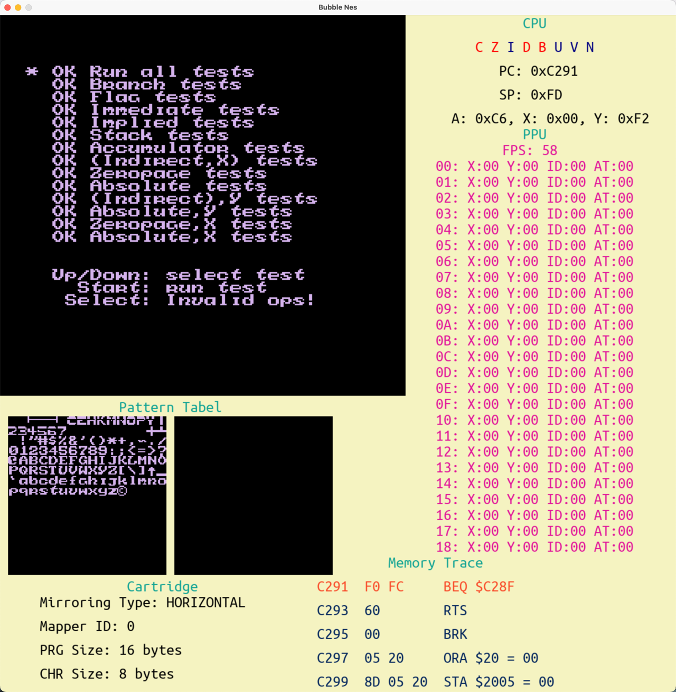
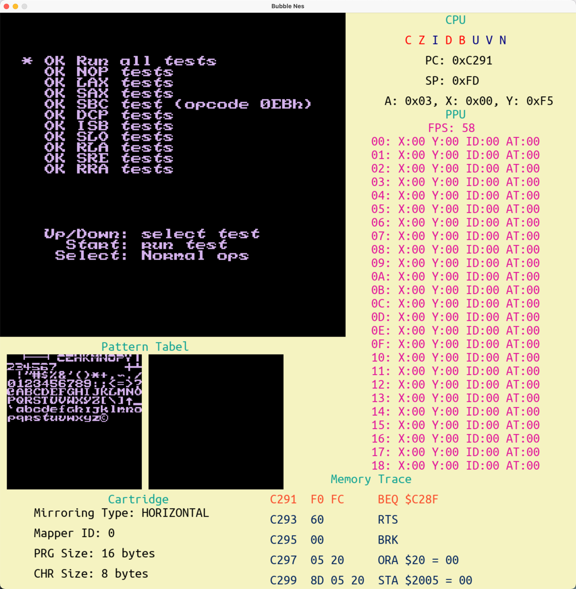

# BubbleNes
A Nes emulator written in Go.


## Install
### Requirements
```bash
# MAC
brew install sdl2{,_image,_mixer,_ttf,_gfx} pkg-config
```

```bash
# Ubuntu
apt install libsdl2{,-image,-mixer,-ttf,-gfx}-dev
```
for other operating systems you can see [this](https://github.com/veandco/go-sdl2#requirements)
### Build

```bash
git clone git@github.com:badbubble/BubbleNes.git
cd BubbleNes/
go mod tidy
go build -o BubbleNes
```


## Play
```bash
./BubbleNes NES_GAME_PATH
```

### Game buttons
| Keyboard | joypads |
|----------|---------|
| W        | Up      |
| S        | Down    |
| A        | Left    |
| D        | Right   |
| P        | Start   |
| O        | Select  |
| K        | A       |
| L        | B       |

## Features & TODOs
* CPU emulation:
    * official instructions
    * unofficial instructions
    * tracing
* PPU emulation
* Cartridge emulation
* Mappers
    * MAPPER_000

Still working on:
- [ ] Mapper_001
- [ ] Mapper_002
- [ ] Mapper_003
- [ ] Mapper_004
- [ ] Mapper_005
- [ ] APU
- [ ] Game Saving
- [ ] Online multiplayer
- [ ] Cheat mode
- [ ] Change sdl2 to a better 2d game engine

## Tests
### nestest
| Official                       | Unofficial                       |
|--------------------------------|----------------------------------|
|  |  |
                       
## Acknowledgments
- [obelisk-6502](https://web.archive.org/web/20210727210256/http://obelisk.me.uk/6502/index.html)
- [nesdev.org](https://www.nesdev.org/)
- [Easy 6502](https://skilldrick.github.io/easy6502/#instructions)
- [Writing NES Emulator in Rust](https://bugzmanov.github.io/nes_ebook/chapter_1.html)
- [olcNES](https://github.com/OneLoneCoder/olcNES)